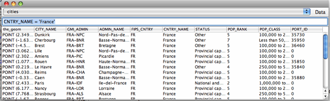

.. include:: <isonum.txt>

.. _querylab:

Query Lab
=========

This tutorial illustrates how to query feature collections in GeoTools. We will build an application that loads a shapefile and displays the attributes of features that match a query condition.

Dependencies
------------

Please ensure your pom.xml includes the following::

    <dependencies>
        <dependency>
            <groupId>org.geotools</groupId>
            <artifactId>gt-main</artifactId>
            <version>${geotools.version}</version>
        </dependency>
        <dependency>
            <groupId>org.geotools</groupId>
            <artifactId>gt-shapefile</artifactId>
            <version>${geotools.version}</version>
        </dependency>
        <dependency>
            <groupId>org.geotools</groupId>
            <artifactId>gt-swing</artifactId>
            <version>${geotools.version}</version>
            <!-- For this module we explicitly exclude some of its own -->
            <!-- dependencies from being downloaded because they are   -->
            <!-- big and we don't need them                            -->
            <exclusions>
                <exclusion>
                    <groupId>org.apache.xmlgraphics</groupId>
                    <artifactId>batik-transcoder</artifactId>
                </exclusion>
            </exclusions>
        </dependency>
    </dependencies>

Example
-------

The example code is available
 * Directly from svn: QueryLab.java_
 * Included in the demo directory when you download the GeoTools source code

.. _QueryLab.java: http://svn.osgeo.org/geotools/trunk/demo/example/src/main/java/org/geotools/demo/QueryLab.java 
 
Main Application
----------------
1. Please create the file **QueryLab.java**
2. Copy and paste in the following code:

   .. literalinclude:: ../../../../../demo/example/src/main/java/org/geotools/demo/QueryLab.java
      :language: java
      :start-after: // docs start source
      :end-before: // docs end main

As you can see most of the code in the main method is to prompt the user for a shapefile and connect to it.
Once we are connected we pass the shapefile (in the form of a DataStore object) to the class that we will look
at next: JQueryFrame.

.. admonition:: Using JDataStoreWizard vs JFileDataStoreChooser

   In :ref:`quickstart` and other examples we used JFileDataStoreChooser to prompt the user for a 
   shapefile. In this example we are using JDataStoreWizard which requires a few more lines of code.
   The advantage of the wizard here is that we can easily modify the code above to have work with
   a PostGIS database instead of a shapefile (see comment in code).
   
The JQueryFrame class
---------------------

Here is the code for the nested class for a dialog with a text field to enter a query and a table to display data for the features that the query selects:

   .. literalinclude:: ../../../../../demo/example/src/main/java/org/geotools/demo/QueryLab.java
      :language: java
      :start-after: // docs start query frame
      :end-before: // docs end source

Most of the method's code is concerned with creating the dialog. The part to note is the Action associated with the "Get features" menu item. This is what is happening:

1. We get the feature type name selected by the user and retrieve the corresponding **FeatureSource** from the DataStore.
2. We get the query condition that was entered in the text field and use the **CQL** class to create a **Filter** object.
3. Now we pass the filter to the **getFeatures** method which returns the features matching the query as a **FeatureCollection** (you met FeatureCollection before in :ref:`csv2shp`).

To display the feature data we create a new **FeatureCollectionTableModel** for our dialog's JTable. This GeoTools class takes a FeatureCollection and retrieves the feature attribute names and the data for each feature.

Running the application
-----------------------

When you run this application it will prompt you for an input shapefile and then display a page with fields for namespace and creating a spatial index - for this shapefile example you can leave both of these fields blank and just click Finish to display the query dialog.

At first the query field will show 'include' which means select all features. Click the *Data->Get features* menu item and the table will display the feature data.

The example queries below refer to the *cities* shapefile available as part of the `uDig sample dataset`__

.. _udigdata: http://udig.refractions.net/docs/data-v1_2.zip 

__ udigdata_

Simple attribute queries
~~~~~~~~~~~~~~~~~~~~~~~~

| **CNTRY_NAME = 'France'**
|   Select all features whose CNTRY_NAME attribute contains 'France'
|
| **POP_RANK >= 5**
|   Select all features with value >= 5 for the POP_RANK attribute
|
| **CNTRY_NAME = 'Australia' AND POP_RANK > 5**
|   Select features which satisfy both conditions

Spatial queries
~~~~~~~~~~~~~~~

| **BBOX(the_geom, 110, -45, 155, -10)**
|   This is a bounding box query that will select all features within the
    area bounded by 110 - 155 |deg| W, 10 - 45 |deg| S (a loose box around Australia).
    Notice that we name the geometry attribute which, for the *cities* shapefile, is
    Point type.

Extra things to try
-------------------

Coming soon...
